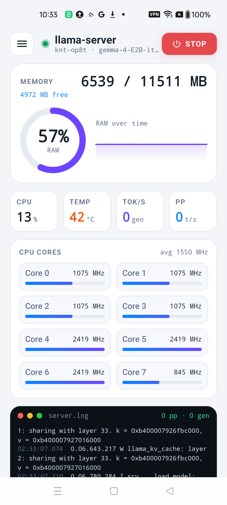
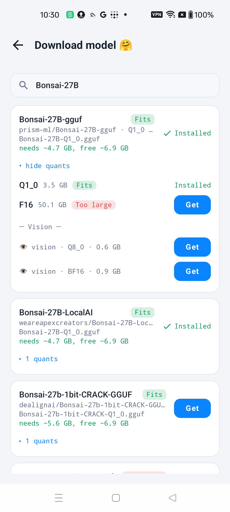
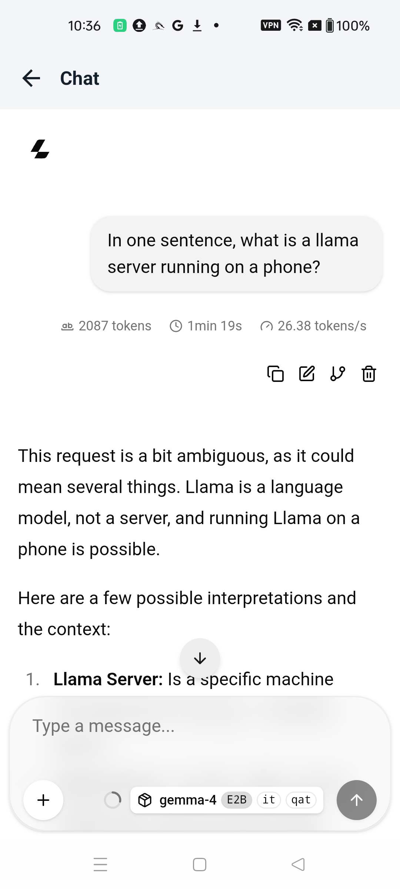
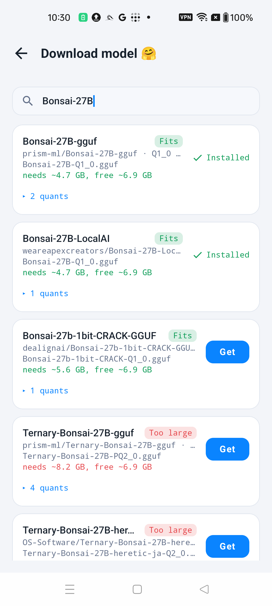
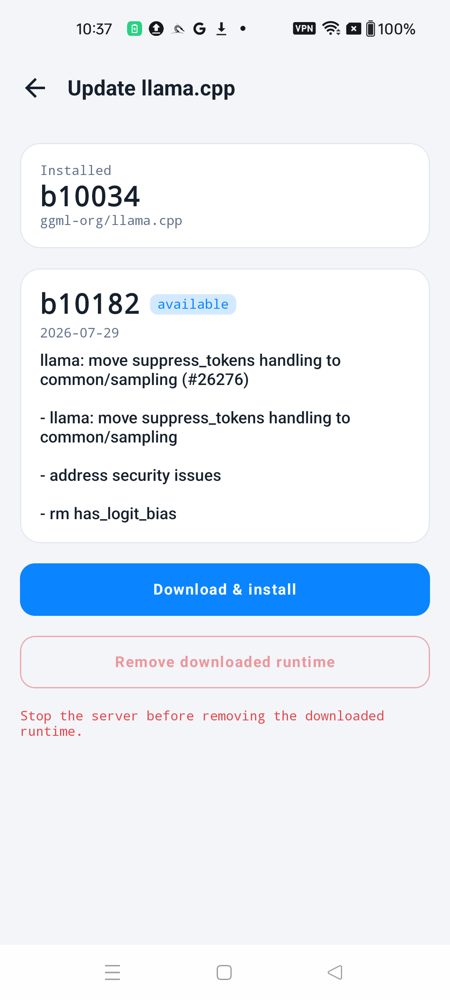
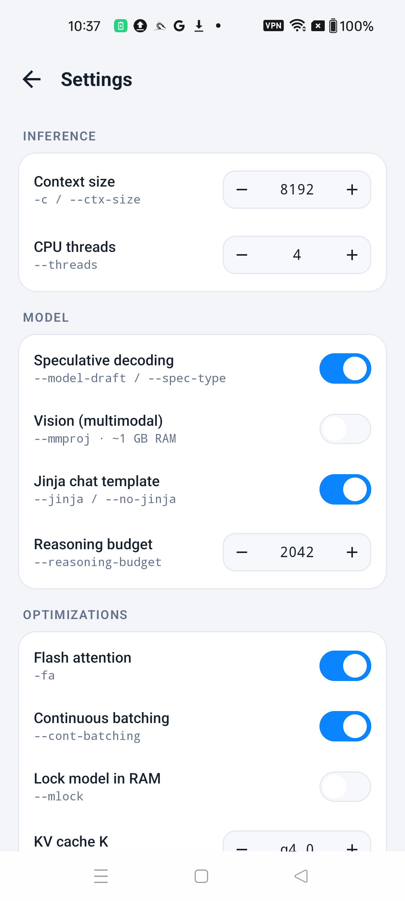
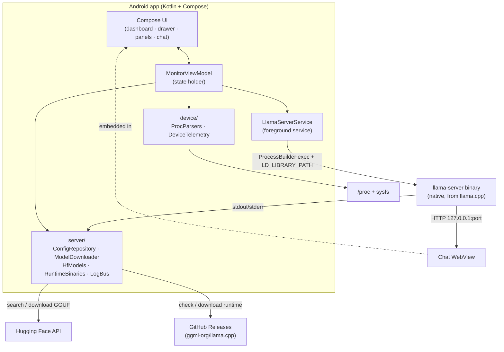

# 🦙 Armored Llama

**Run [llama.cpp](https://github.com/ggml-org/llama.cpp) as a real server on your Android phone — download models from Hugging Face, chat with them locally, and watch the hardware work, all on-device.**

[](https://github.com/guarismo/armored-llama/actions/workflows/ci.yml)
[](https://github.com/guarismo/armored-llama/releases/latest)
[](LICENSE)


Armored Llama isn't a wrapper around a cloud API and it isn't a re-implementation of inference. It runs the **actual `llama-server` binary** from upstream llama.cpp on your phone's CPU, serving an OpenAI-compatible endpoint on `127.0.0.1`, and wraps it in a native Jetpack Compose app: a live hardware dashboard, a Hugging Face model browser, an in-app chat, and a one-tap runtime updater. Everything stays on the device — no network round-trips for inference, no accounts.

<p align="center">
  
</p>

---

## Contents

- [Features](#features)
- [Screenshots](#screenshots)
- [Install](#install)
- [Which model should I run?](#which-model-should-i-run)
- [How it works](#how-it-works)
- [Architecture](#architecture)
- [Project layout](#project-layout)
- [Build from source](#build-from-source)
- [Releasing](#releasing)
- [Contributing](#contributing)
- [License &amp; attribution](#license--attribution)

---

## Features

- **Real on-device inference.** Starts/stops the upstream `llama-server` binary via a foreground service; the OpenAI-compatible API is served on `http://127.0.0.1:<port>`.
- **Live hardware dashboard.** RAM, CPU %, per-core clocks, SoC temperature, and generation / prompt-processing throughput (tok/s), all read from `/proc` + `sysfs` and the server's own logs.
- **Hugging Face model browser.** Search GGUF repos; every quant in a repo is listed with a **RAM-fit estimate**, and the best-fitting quant is headlined automatically. Optional vision (`mmproj`) companions download and wire themselves in.
- **In-app chat.** The official llama.cpp web UI, embedded in a retained WebView so a generation keeps streaming even if you leave the panel.
- **One-tap runtime updates.** Check GitHub Releases for `ggml-org/llama.cpp`, download the arm64 build, and switch to it — with the bundled build as a safe fallback.
- **Tunable launch flags.** Context size, threads, flash attention, KV-cache type, continuous batching, speculative decoding, and more — each mapped to its `llama-server` flag.

## Screenshots

| Dashboard | Quant picker | Chat |
|---|---|---|
|  |  |  |
| Live RAM / CPU / temp / tok-s + streaming server log | Every quant per repo with a RAM-fit badge; vision companions | The llama.cpp web UI running a local model |

| Model search | Update runtime | Settings |
|---|---|---|
|  |  |  |
| Hugging Face GGUF search with fit estimates | Check &amp; install newer llama.cpp builds | Every launch flag, mapped to its `llama-server` option |

## Install

**Easiest — grab a prebuilt APK:**

1. Go to [**Releases**](https://github.com/guarismo/armored-llama/releases/latest) and download `armored-llama-<version>.apk`.
2. On your phone, allow installing from your browser/file manager (Android will prompt), then open the APK.
3. Launch the app → **Download model 🤗** → search and download a model (start with `gemma-4`) → tap **Start**.

**Requirements:** an **arm64-v8a** Android phone running **Android 8.0 (API 26)** or newer. The APK is debug-signed (see [Releasing](#releasing)); each release installs as an update over the previous one.

> Prefer to build it yourself? See [Build from source](#build-from-source).

## Which model should I run?

This is a **phone CPU**, so model size dominates the experience. As a rule of thumb, stick to **~4B-parameter** models:

| Model | Size (approx) | Feel on-device |
|---|---|---|
| **`gemma-4` E2B** (curated default) | ~2.2 GB (Q2_K_XL) | ✅ Best — ~10 tok/s with its MTP speculative-decode draft |
| `Qwen3.5-4B` (Q4_K_M) | ~2.7 GB | ✅ Good |
| `Bonsai-4B` (Q1_0) | ~0.6 GB | ✅ Fast and tiny |
| 27B-class models (even at 1-bit) | 3.8 GB+ | ⚠️ Runs, but ~1 tok/s — a reply can take minutes |

The model browser estimates each quant's RAM fit against your free memory and badges it **Fits / Tight / Too large**, but "fits" is about memory, not speed — a 27B that *fits* is still slow. When you switch models, **start a new chat**: the web UI resends the whole conversation each turn, so a long history compounds the slowness.

## How it works

The app is a thin, native shell around the real thing:

1. **The server is a process, not a library.** `LlamaServerService` (an Android foreground service) launches the llama.cpp `llama-server` executable with `ProcessBuilder`, pointing `LD_LIBRARY_PATH` at its shared libraries, and streams the process's stdout/stderr into the on-screen log feed. Because Android won't execute arbitrary files under a modern `targetSdk`, the app targets **API 28**, which still permits executing a binary staged in the app's native-library directory. The executable is shipped as `libllamaserver.so` so the packager marks it executable and extracts it.
2. **Models live in app storage.** GGUF files download from Hugging Face into the app's external files dir; `config.ini` records the active model + launch flags.
3. **Chat talks to localhost.** The Chat screen is a WebView pointed at `http://127.0.0.1:<port>` — the server's own web UI. A `network_security_config` permits cleartext to loopback only.
4. **Telemetry is measured, not faked.** CPU %, per-core MHz, memory, and temperature are parsed from `/proc/stat`, `cpufreq`, `/proc/meminfo`, and `thermal_zone*`; throughput is parsed live from the server's `print_timing` log lines. Pure parsers sit behind a `FileSource` seam so they're unit-tested on the host JVM.
5. **The runtime updates itself.** The updater reads GitHub Releases for `ggml-org/llama.cpp`, downloads the `android-arm64` tarball, extracts it into `filesDir/llama/<tag>/`, and runs that instead of the bundled build — falling back to the bundled `b9775` if a downloaded build is missing or fails.

## Architecture



**Design seams that keep it testable:** the pure logic — INI parse/write, launch-arg building, HF tree parsing + quant selection, RAM-fit estimation, `/proc` parsers, release-note sanitizing — has **no Android dependencies** and is covered by host-JVM JUnit tests (`app/src/test/…`). Android glue (service, downloader, WebView, telemetry IO) is thin and sits on top.

## Project layout

| Concern | Location |
|---|---|
| Root composition / activity | `MainActivity.kt`, `ui/MonitorScreen.kt` |
| State model | `model/MonitorState.kt` |
| State holder (telemetry + server/download wiring) | `MonitorViewModel.kt` |
| Server runtime (config, args, download, updater, logs, service) | `server/` |
| Hugging Face search + quant selection | `server/HfModels.kt`, `server/ModelLibrary.kt` |
| RAM-fit estimate | `server/ModelFit.kt` |
| Device telemetry (pure parsers + IO) | `device/ProcParsers.kt`, `device/DeviceTelemetry.kt` |
| Console dashboard | `ui/console/ConsoleDashboard.kt` |
| Drawer + full-screen panel host | `ui/menu/MenuOverlay.kt` |
| Settings / Update / Download panels | `ui/menu/SubPanels.kt` |
| Chat WebView | `ui/chat/` |
| Design docs & implementation plans | `docs/`, `IMPLEMENTATION_NOTES.md` |

## Build from source

**Requirements:** JDK 17+, Android SDK (compileSdk 36), and an internet connection on first build (to fetch the llama.cpp binaries). An arm64-v8a device or emulator to run it.

```bash
git clone https://github.com/guarismo/armored-llama.git
cd armored-llama

# Build the debug APK (also downloads the pinned llama.cpp b9775 arm64 server automatically)
./gradlew assembleDebug          # Windows: gradlew.bat assembleDebug

# Run the unit-test suite
./gradlew testDebugUnitTest

# Install onto a connected device
./gradlew installDebug
```

The `fetchLlamaServer` Gradle task (in `app/build.gradle.kts`) runs before every build and downloads llama.cpp release **`b9775`** (android-arm64), staging the `llama-server` executable (as `libllamaserver.so`) plus its `*.so` dependencies into `app/src/main/jniLibs/arm64-v8a/`. Those binaries are **git-ignored** and re-fetched on a clean checkout. To pin a different bundled build, change `llamaRelease` in `app/build.gradle.kts` (and keep `RuntimeBinaries.BUNDLED_TAG` in sync).

Or just open the project in **Android Studio** and hit Run.

## Releasing

Releases are automated. Push a tag and CI builds the APK and attaches it to a GitHub Release:

```bash
git tag v1.0
git push origin v1.0
```

The [`Release APK`](.github/workflows/release.yml) workflow builds `assembleDebug`, renames the APK to `armored-llama-<tag>.apk`, and publishes a release with generated notes. The APK is signed with the **committed debug keystore** (`app/debug.keystore`, password `android`) — a throwaway debug key, safe to publish, that keeps a stable signature so each release installs as an update over the last. For a Play-Store-grade signed build, add a real `release` signing config with secrets and switch the workflow to `assembleRelease`.

## Contributing

Issues and PRs are welcome. The codebase leans on small, pure, unit-tested units — please keep that shape: put logic in an Android-free function with a host-JVM test where you can, and keep the Android glue thin. `./gradlew testDebugUnitTest` should stay green.

## License &amp; attribution

This project is licensed under the [MIT License](LICENSE) © 2026 Igor Guarisma.

- **[llama.cpp](https://github.com/ggml-org/llama.cpp)** (ggml-org) — the inference engine and `llama-server` binary that Armored Llama runs, is bundled from, and updates against. MIT-licensed; © the llama.cpp authors.
- **Models** downloaded through the app (Gemma, Qwen, Bonsai, …) are distributed by their respective authors on Hugging Face under **their own licenses** — review each model's terms before use. They are not part of this repository.
